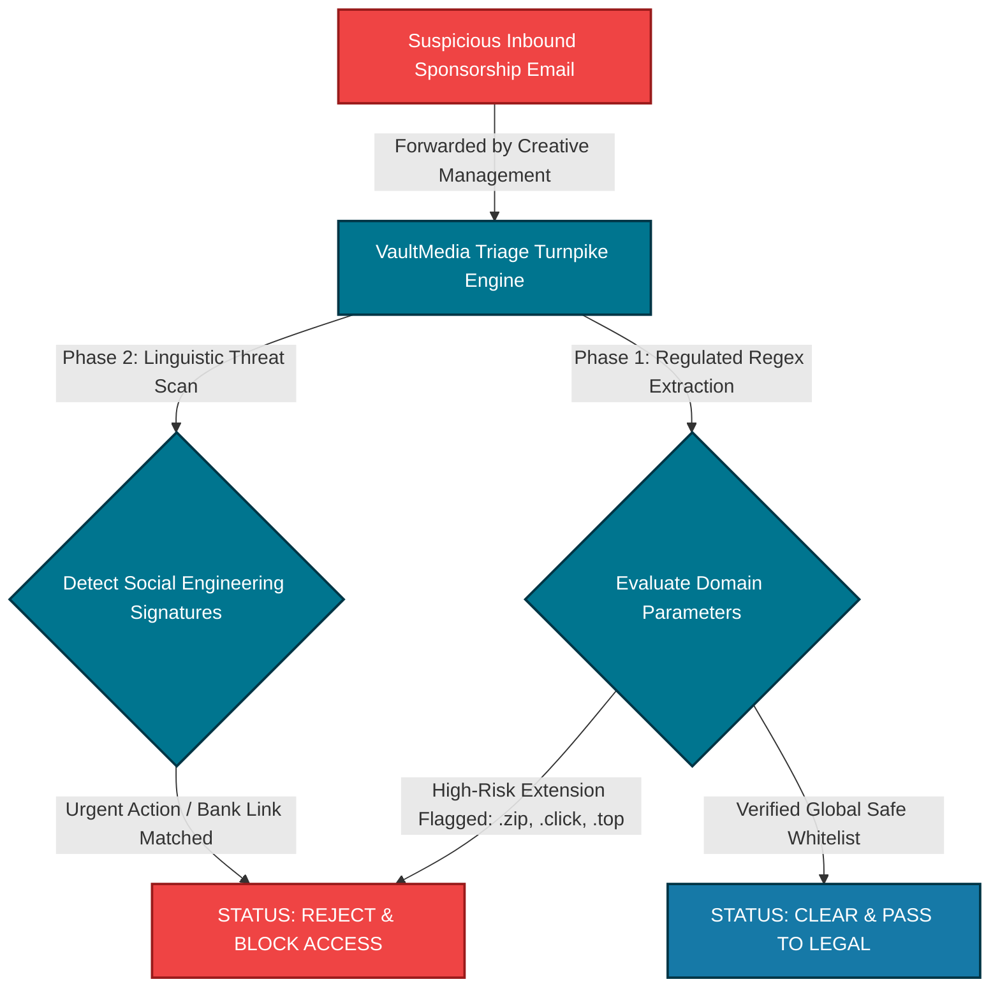

# 🛡️ Inbound Revenue Protection Architecture (Sponsorship Gatekeeper Engine)

An enterprise-tier automated triage engine engineered to neutralize phishing, credential harvesting, and session-token theft vectors targeting high-revenue digital content creators, independent record labels, and talent management houses.

---

## 📊 The Infrastructure Bottleneck Strategy (The Rockefeller Turnpike)
Digital media and entertainment businesses lose critical revenue when team members interact directly with unverified external communication links. VaultMedia Security establishes an automated technical gatekeeper on the network perimeter. Every incoming collaboration proposal, sponsorship file package, or external hyperlink string must pass through this triage engine for structural validation before accessing internal communication tiers.



---

## 🧰 Technical Capability Matrices
*   **Static Domain Whitelisting Mapping:** Instantly separates verified, authoritative corporate entities (e.g., Spotify, Apple, Google) from dynamic, adversarial infrastructure.
*   **High-Risk TLD Filtering:** Automatically identifies and flags dangerous domain structures (e.g., `.zip`, `.click`, `.top`, `.download`) heavily favored by modern infostealer malware distributions targeting artists.
*   **Linguistic Behavioral Analysis:** Scans body text components for high-pressure social engineering telemetry and risk patterns ("download stems", "review NDA") to protect your company's digital session keys.

---

## 🚀 Local Deployment Syntax
Execute the analysis engine against raw text payloads using the command-line interface parameters:
```bash
python3 sponsorship_triage.py -t "Input suspicious message text inside quotation strings"
```
